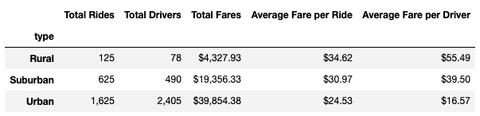
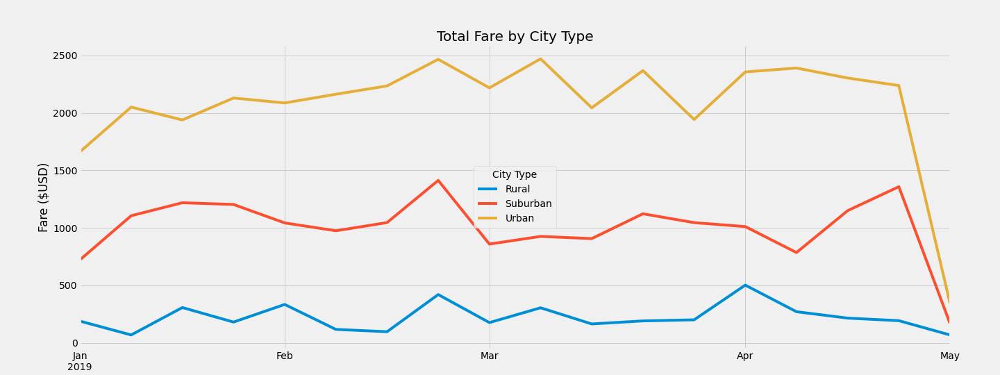

# PyBer_Analysis
## Overview of Project
### Purpose
Performing an exploratory analysis and creating visualizations using rideshare data to show the total weekly fares for each city type. 

## Results
The PyBer summary data frame provides a synopsis of PyBer’s ridesharing services in three types of cities: rural, suburban, and urban cities. The data frame shows the total rides, total drivers, total fares, average fare per ride, and average fare per driver. As you can see below, urban cities seem to have the highest number of rides and drivers, by a lot. The total fares for urban cities are the highest by about $35,000 more than rural cities and $20,000 more than suburban cities. The average fare per ride is roughly $35 for rural cities, which is about $10 higher than the average fare per ride for urban cities. The average fare per ride for suburban cities is in between these two average fares, at about $31. This shows that it is more beneficial for drivers in rural cities as they will make more money per ride. However, the average fare per driver in rural cities is the highest, roughly $56, while it is about $17 in urban cities. Suburban cities seem to be in the middle again, with an average fare of about $40 per driver. Overall, the average fare per ride is the greatest for rural cities, but with the high average fare per driver, it might not be as beneficial as we would expect. 

The following image is a multiple-line chart “Total Fare by City Type”. This plot shows the trends of total fares in each city type between January 2019 and April 2019. The yellow line shows that the total fare for urban cities started at $1600 in January 2019 and ended in April 2019 at around $2300. The orange line shows that the total fare for suburban cities started at about $750 in January 2019 and ended around $1400 in April 2019. The blue line shows that the total fare for rural cities started at about $200 in January 2019 and ended around $200-$250 in April 2019. Looking at the plot, all three lines seem to show similar peak times for the three types of cities. One huge peak for each type of city seems to be around the end of February 2019. All three lines seem to show a steep decrease in total fare at the end of April 2019. 

## Summary
The analysis shows that there is a significantly higher usage of PyBer ridesharing services for drivers and riders in urban cities.There is a lot more usage of PyBer rideshare in urban cities than suburban and rural cities. In addition, there are 30 times more drivers in urban cities than in rural cities. The majority of PyBer’s revenue comes from urban cities, and the average fare per rider is the highest in rural cities. This could lead to potential riders being discouraged from using PyBer in these rural areas. However, the average fare per driver is the highest in rural cities, which could lead to more potential drivers in these areas, despite the low number of riders. Overall, there is a big discrepancy in these statistics between all three of these city types. 

